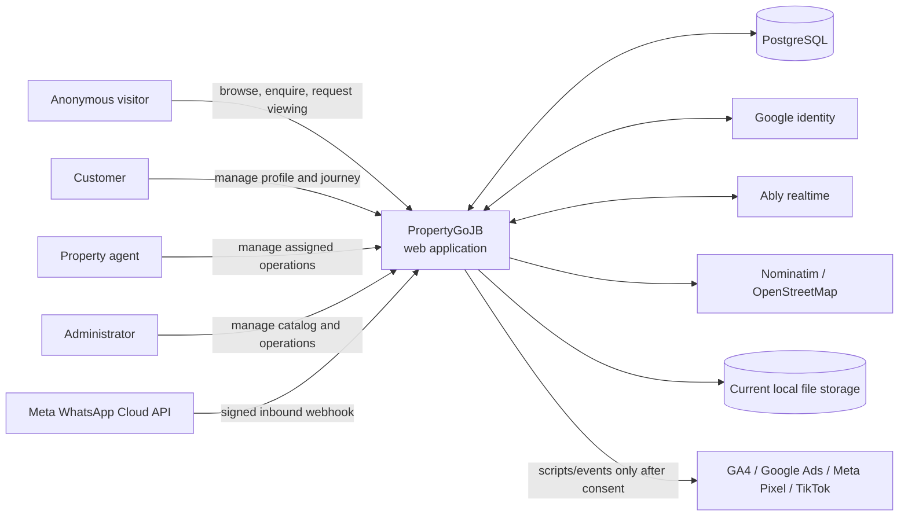
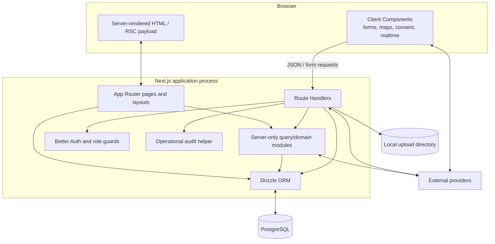
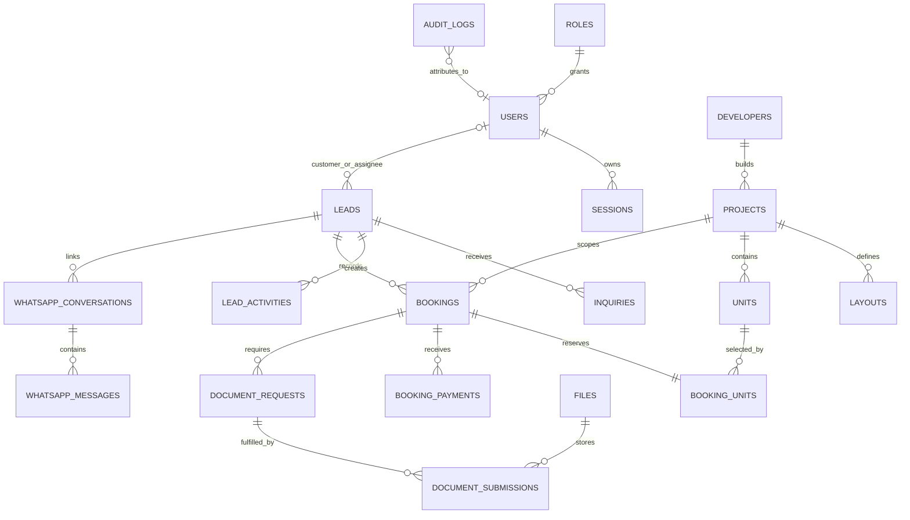
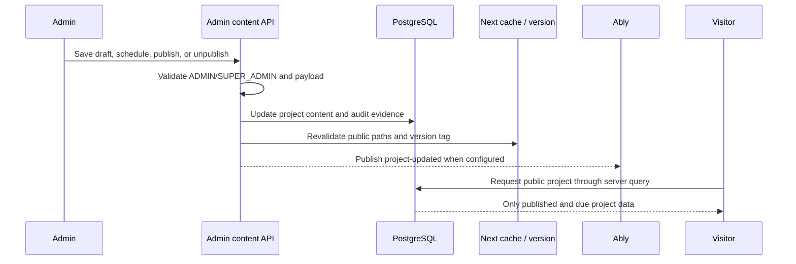
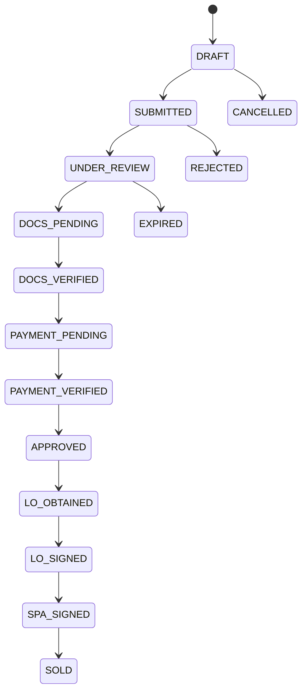
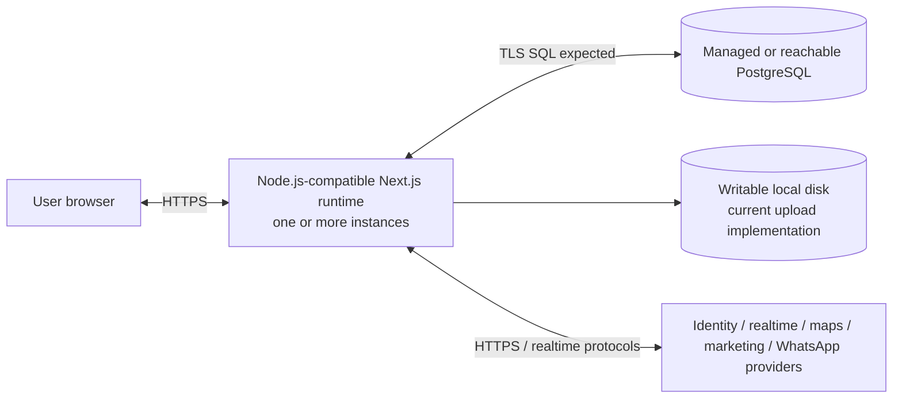

# PropertyGoJB System Design

- **Status:** Living current-state architecture overview
- **Last verified:** 4 September 2026
- **Owner:** PropertyGoJB product/engineering owner
- **System:** PropertyGoJB web application and its supporting data/integration boundaries

This document is the architectural entry point for PropertyGoJB. It explains what the system is, how the repository is organized, how important flows execute, which invariants must survive change, and where the implementation is not yet production-complete.

It describes the repository snapshot, not an idealized future system. Statements marked **Current** are evidenced in the repository. Statements marked **Target** or **Gap** are planned controls or known limitations and must not be treated as implemented guarantees. The canonical business rules remain [the active rule registry](docs/sdlc/business-rules.json); this document does not replace or change them.

## 1. Goals and scope

PropertyGoJB supports the path from property discovery to managed sale through one application with three connected product surfaces:

| Surface                             | Users                                 | Primary capabilities                                                                                                                        |
| ----------------------------------- | ------------------------------------- | ------------------------------------------------------------------------------------------------------------------------------------------- |
| Public website and customer account | Anonymous visitors and CUSTOMER users | Project discovery, unit availability, enquiries, viewing requests, registration/login, profile, enquiries, viewings, and booking visibility |
| Agent portal                        | AGENT users                           | Assigned leads and customers, follow-ups, appointments, properties, bookings, documents, and reports                                        |
| Admin portal                        | ADMIN and SUPER_ADMIN users           | Users and agents, catalog/content/imports, inventory, CRM assignment, bookings/payments/documents, reporting, and settings                  |

The system optimizes for these quality goals, in priority order:

1. **Business-state integrity:** project visibility, lead ownership, inventory reservation, booking transitions, payments, and documents must not enter contradictory states.
2. **Authorization and privacy:** every protected mutation must re-establish identity, role, and record scope at the server boundary; sensitive customer data stays minimized and server-side.
3. **Auditability:** meaningful operational decisions and mutations must be attributable without turning high-volume analytics into audit records.
4. **Maintainability:** public, agent, and admin experiences share one deployable application and data model while retaining explicit role and domain boundaries.
5. **Customer experience:** public pages are indexable only in production, responsive, accessible, progressively server-rendered, and enhanced with consented analytics and optional realtime refresh.

### In scope

- The Next.js application under `src/`.
- The PostgreSQL model, Drizzle migrations, and seed/reference data.
- Authentication and authorization boundaries.
- Public, CRM, inventory, booking, payment, document, reporting, audit, and inbound WhatsApp domains.
- Directly connected providers and the logical deployment shape.

### Out of scope

- A production infrastructure topology: no deployment platform or pipeline is committed.
- Runtime AI: no customer-facing LLM or agent exists in the product.
- Legal compliance claims or operational procedures that are not implemented in this repository.
- Detailed screen specifications, import payload contents, and provider-specific runbooks.

## 2. Architectural constraints

| Constraint                                 | Consequence                                                                                                                                                                                                      |
| ------------------------------------------ | ---------------------------------------------------------------------------------------------------------------------------------------------------------------------------------------------------------------- |
| Next.js App Router 16.2.9 and React 19.2.4 | Installed documentation under `node_modules/next/dist/docs/` is authoritative before changing framework behavior. Route groups organize surfaces without affecting URLs.                                         |
| Strict TypeScript                          | Application code is type-checked without emit; external inputs still require runtime validation.                                                                                                                 |
| PostgreSQL with Drizzle ORM                | Production catalog, CRM, booking, and governance state lives in relational tables and migrations, not mock JSON fallbacks.                                                                                       |
| Better Auth                                | Sessions and identity accounts share the application database; public user creation is forced to CUSTOMER.                                                                                                       |
| Four coarse runtime roles                  | CUSTOMER, AGENT, ADMIN, and SUPER_ADMIN are the currently enforced top-level roles. Seeded granular permissions and two-person approvals are not broadly enforced yet.                                           |
| Malaysia operating context                 | Viewing slots use Malaysia time. Booking currency defaults to MYR. Privacy and retention decisions require accountable human review.                                                                             |
| Guarded engineering workflow               | Repository changes follow [the Agentic SDLC](docs/AI_AGENTIC_SDLC.md); production, destructive, privilege, payment-verification, document-decision, outbound-message, and merge actions remain human-controlled. |
| Dirty-worktree preservation                | The WhatsApp webhook work visible in this snapshot is in progress and may be uncommitted. Its presence is documented but not normalized or altered here.                                                         |

## 3. System context

The context view follows the C4 convention: it shows people and neighboring systems before implementation detail. The accompanying table remains the accessible source of the same information.



| Neighbor                | Interface and data exchanged                                                 | Trust/availability notes                                                                                                         |
| ----------------------- | ---------------------------------------------------------------------------- | -------------------------------------------------------------------------------------------------------------------------------- |
| PostgreSQL              | SQL through `postgres` and Drizzle; all core business and identity state     | Required at application startup; transaction correctness is critical                                                             |
| Google identity         | OAuth provider through Better Auth                                           | Optional; enabled only when both server-side provider settings exist                                                             |
| Ably                    | Server REST publishing and short-lived, subscribe-only public tokens         | Optional; public project pages fall back to a 60-second version check                                                            |
| Nominatim/OpenStreetMap | Server-side HTTPS geocoding and public map presentation                      | External rate limits/failures are handled as unavailable results; the current geocode cache is process-local                     |
| Marketing providers     | Browser-loaded scripts and normalized events                                 | Disabled until explicit marketing consent; attribution is suppressed/revoked on denial                                           |
| WhatsApp Cloud API      | Verification challenge and HMAC-signed inbound webhook payloads              | In-progress deterministic V1; event deduplication is database-backed; durable queuing/retry and outbound policy are not complete |
| File storage            | Current document uploads under `.local-uploads`, represented by `files` rows | Development-oriented local implementation; durable object storage and malware-clean gating are production gaps                   |

## 4. Solution strategy

PropertyGoJB is a database-backed modular monolith: one Next.js deployable contains server-rendered pages, client interaction islands, route-handler APIs, domain/query helpers, and a single PostgreSQL schema.

The core strategies are:

- Prefer Server Components for page composition and database reads; isolate browser state, forms, maps, providers, and other interactive behavior behind explicit `"use client"` boundaries.
- Send client mutations to Route Handlers. Each protected mutation is expected to validate input, authenticate, authorize role and ownership, preserve domain invariants, and record appropriate history/audit evidence.
- Treat PostgreSQL as the source of truth. Use transactions for multi-table mutations and constraints/indexes for invariants that can be expressed in the database.
- Keep product domains recognizable in `src/lib` and `src/db/schema`, while accepting that the current codebase still contains significant route/page-local data access and domain logic.
- Separate operational audit records from consented marketing analytics.
- Keep external capabilities optional where possible: Ably has polling fallback; Google login is configuration-gated; marketing providers are consent-gated.
- Preserve deterministic, human-governed behavior for payments, document decisions, privilege changes, and customer communication.

This aligns with current Next.js guidance: pages/layouts are Server Components by default, Client Components are for state and browser APIs, and Route Handlers expose Web `Request`/`Response` endpoints. It also follows the framework security guidance to keep sensitive access server-only and re-authorize mutations at their execution boundary.

## 5. Building-block view

### 5.1 Logical containers



The arrows from pages and APIs directly to Drizzle are intentional documentation of the current implementation, not the desired endpoint. At this snapshot, 69 files under `src/app` import the database boundary directly, while 16 modules under `src/lib` do so. **Target:** move high-value mutation logic into cohesive server-only domain commands and converge reads on narrow data-access modules.

### 5.2 Repository organization

| Path                                                     | Responsibility                                                                                         | Boundary rule                                                                                                                   |
| -------------------------------------------------------- | ------------------------------------------------------------------------------------------------------ | ------------------------------------------------------------------------------------------------------------------------------- |
| [`src/app`](src/app)                                     | App Router pages, layouts, metadata, sitemap/robots, and Route Handlers                                | A route exists only through `page.tsx` or `route.ts`; route groups `(public)`, `(auth)`, and `(internal)` do not appear in URLs |
| [`src/app/(public)`](<src/app/(public)>)                 | Public marketing, project, and authenticated customer-account pages                                    | Published visibility and customer identity linkage are server-controlled                                                        |
| [`src/app/(internal)/agent`](<src/app/(internal)/agent>) | Agent pages and role-gated shell                                                                       | Page layout allows AGENT and, temporarily for development, SUPER_ADMIN; mutation routes must still authorize records            |
| [`src/app/(internal)/admin`](<src/app/(internal)/admin>) | Admin pages and role-gated shell                                                                       | ADMIN/SUPER_ADMIN layout guard; high-impact decisions remain explicitly human-controlled                                        |
| [`src/app/api`](src/app/api)                             | Public, auth, admin, internal, automation, and webhook HTTP boundaries                                 | Treat every body, query, path param, and webhook as untrusted input                                                             |
| [`src/components`](src/components)                       | Shared UI primitives plus public/admin/agent/internal feature components                               | Client components receive minimal serializable data and call APIs for mutations                                                 |
| [`src/lib`](src/lib)                                     | Auth, API response helpers, queries, validation, domain calculations, integrations, audit, and imports | Sensitive modules use `server-only`; this is the preferred home for reusable server logic                                       |
| [`src/db`](src/db)                                       | Database client, schemas, seeds, and development-only scripts                                          | Database URL is mandatory; production connection pool maximum is configured in the client                                       |
| [`drizzle`](drizzle)                                     | Ordered SQL migrations and schema snapshots                                                            | Changes require reviewed migration and recovery evidence                                                                        |
| [`src/config`](src/config)                               | Routes, roles, brand/site configuration, and static public copy                                        | Public environment variables are presentation/provider identifiers only; secrets stay server-side                               |
| [`docs`](docs)                                           | Operational, QA, SDLC, work-item, and feature documentation                                            | Active business rules are canonical in `docs/sdlc/business-rules.json`                                                          |

Snapshot size: 340 source files, 64 page files, 52 API route-handler files, 82 files declaring a client boundary, nine SQL migrations, and 17 test files. Counts are orientation aids rather than architectural invariants.

### 5.3 Request boundaries

**Read path**

1. A page/layout executes as a Server Component unless it declares `"use client"`.
2. It reads through a query helper or, in many current pages, directly through the Drizzle client.
3. PostgreSQL results are shaped into view models.
4. Only serializable, presentation-required fields cross into Client Components.

**Mutation path**

1. A Client Component submits JSON or `FormData` to a Route Handler.
2. The handler parses and validates the request, normally with Zod.
3. Protected handlers resolve the Better Auth session and role; record ownership is checked by the handler/domain flow where applicable.
4. Related writes execute in a transaction where implemented, with status history/activity records for domain state changes.
5. Meaningful mutations write a sanitized operational audit entry and may invalidate/rebroadcast public project state.
6. The handler returns a JSON response through shared helpers where adopted.

**Gap:** route authorization and error behavior are not yet uniform. Some handlers use redirect-oriented `requireRole`, others use API authorization helpers, and raw error details can still reach clients. A stable error-code/request-ID contract remains target work.

## 6. Data architecture

The Drizzle schema is split by domain and re-exported through [`src/db/schema/index.ts`](src/db/schema/index.ts). Most mutable domain tables use shared IDs, timestamps, and soft-delete fields from [`src/db/schema/base.ts`](src/db/schema/base.ts).

### 6.1 Domain groups

| Domain                  | Principal tables                                                                                     | Responsibility                                                                                             |
| ----------------------- | ---------------------------------------------------------------------------------------------------- | ---------------------------------------------------------------------------------------------------------- |
| Identity and access     | `roles`, `users`, `session`, `account`, `verification`, `otp_challenges`                             | Identity, sessions, coarse roles, social/password/phone authentication, purpose-bound OTPs                 |
| Governance              | `permission_groups`, `permissions`, `role_permissions`, `user_permissions`, `admin_action_approvals` | Fine-grained and two-person control model; currently only partially enforced at runtime                    |
| Geography and lookups   | `states`, `regions`, `areas`, property/booking/appointment lookup tables                             | Seeded reference data and display/status vocabularies                                                      |
| Catalog                 | `developers`, `projects`, phases, towers, layouts, media, amenities, tags, nearby places             | Project facts, marketing content, publication, SEO, and structured availability plans                      |
| Inventory and pricing   | `units`, `pricing_snapshots`                                                                         | Saleable units, current booking status, and dated price ranges                                             |
| CRM                     | `lead_sources`, `leads`, `inquiries`, assignments, activities, status history                        | Customer interest, deduplicated identity/contact, ownership, follow-up, appointment, and lifecycle history |
| Booking                 | `bookings`, booking units, participants, status history, payments, activities                        | Reservation, buyer participants, money state, legal workflow, expiry, and sales progression                |
| Documents and files     | `files`, document types, requests, submissions, verification logs, access logs                       | File metadata, document requests/versioning, human decisions, and access evidence                          |
| WhatsApp                | queues, queue members, assignment rules, conversations, messages, webhook events, delivery events    | Deterministic inbound ingestion, deduplication, lead linkage, routing, and delivery-state records          |
| Audit and configuration | `audit_logs`, `auth_audit_logs`, `system_settings`, `feature_flags`, overrides                       | Operational evidence and configurable behavior                                                             |

### 6.2 Simplified relationship model



This diagram omits lookup, history, queue, approval, and join tables. The schema and migrations are authoritative for cardinality.

### 6.3 Data classification

| Class        | Examples                                                                                                             | Handling expectation                                                    |
| ------------ | -------------------------------------------------------------------------------------------------------------------- | ----------------------------------------------------------------------- |
| Public       | Published project facts, public marketing copy, public documentation                                                 | May be rendered/indexed only through publication rules                  |
| Internal     | Source code, non-secret configuration names, operational reference data                                              | Repository/team access; never assume it is public                       |
| Confidential | Contact details, nationality, enquiries, assignments, conversations, bookings, payments, audit snapshots             | Minimize responses and logs; enforce authenticated role/ownership scope |
| Restricted   | Credentials, sessions, OTP values/hashes, raw production records, uploaded customer documents, raw WhatsApp payloads | Never model-visible; tightly authorized human/system processing only    |

Soft deletion is common, but the repository does not yet contain a complete retention/deletion, backup/restore, DSAR, or breach runbook. Those are operational and privacy gaps rather than guarantees supplied by the schema.

## 7. Representative runtime views

Only architecturally significant scenarios are shown. Route and domain implementations remain the detailed source of truth.

### 7.1 Public project publication and discovery



- Generic project creation starts unpublished.
- [`src/app/api/admin/projects/[projectId]/content/route.ts`](src/app/api/admin/projects/[projectId]/content/route.ts) owns publication scheduling and marketing content.
- [`src/lib/public/projects.ts`](src/lib/public/projects.ts) filters out unpublished and future-scheduled projects for catalogs and details.
- [`src/lib/public/project-revalidation.ts`](src/lib/public/project-revalidation.ts) invalidates affected routes and broadcasts through Ably when configured.
- Sitemap and metadata must use the same visibility rule; public pages must not invent separate publication logic.

### 7.2 Enquiry and viewing request

1. The public form sends contact/project interest and optional viewing preference to [`/api/public/leads`](src/app/api/public/leads/route.ts).
2. Server validation normalizes contact data and validates viewing time in `Asia/Kuala_Lumpur`: 30-minute increments, 09:00–18:00, at least one hour ahead, and no more than 180 days ahead.
3. The transaction finds or creates the lead, adds an inquiry, and links `customer_user_id` only when an authenticated identity matches the submitted phone or email.
4. A viewing becomes a `lead_activities` row with `activity_type = VIEWING_APPOINTMENT` and `appointmentStatus = REQUESTED`.
5. An identical active lead/project/instant request is reused. REQUESTED means staff review is still required; it is not a confirmed appointment.
6. Operational audit records capture enquiry and viewing creation/reuse without storing an unrestricted form payload.

### 7.3 Lead assignment and CRM work

- Admins can assign leads; agents can claim eligible open leads and may operate only on assigned records.
- `leads` stores current status/assignee for efficient reads; `lead_assignments`, `lead_status_history`, and `lead_activities` preserve the operational timeline.
- Follow-ups and viewing appointments reuse lead activities rather than introducing a parallel appointment aggregate.
- **Gap:** the current agent-claim flow performs a read followed by multiple writes without an atomic conditional ownership update and lacks complete audit coverage. It must not be considered concurrency-safe merely because the partial unique assignment index exists.

### 7.4 Booking and unit lifecycle

Booking creation from a lead checks role, assigned-agent ownership, project/unit consistency, and unit availability. A transaction then creates the booking, one booking-unit association, a primary participant, default document requests, status/activity history, lead updates, and the unit reservation status.

The principal happy path is:



The diagram intentionally shows only a representative path and terminal alternatives. The complete transition graph is declared in [`src/app/api/internal/bookings/status/route.ts`](src/app/api/internal/bookings/status/route.ts). Status changes also synchronize unit state, booking history, activity, and release behavior.

- Reservation expiry defaults to three days and letter-of-offer signing to 14 days through system settings.
- Expiry processing is designed to be repeatable and records its decisions.
- Payment verification/refund and document verification/rejection/waiver are human decisions; automation may prepare evidence but must not execute a real decision.
- **Gap:** booking creation checks for conflicts inside a transaction but lacks a database constraint/locking design that guarantees one active reservation under concurrent requests.

### 7.5 Documents and files

1. Staff creates a typed document request for a booking/participant.
2. An authorized user uploads against that request. Metadata and the file row are stored; the current binary is written below `.local-uploads` and marked `PENDING` scan status.
3. Submission versions and replacement links preserve document history.
4. Authorized staff performs the document decision; an immutable verification log and booking activity must accompany it.
5. Downloads must enforce server-side booking/role ownership and write access evidence.

**Gap:** the schema models visibility, scan status, verification, and access logs, but local storage, declared MIME checks, pending scan handling, and incomplete access logging are not a production-safe document service. The target requires durable object storage, content/magic-byte validation, malware `CLEAN` gating, and complete access audit.

### 7.6 WhatsApp inbound V1 (in progress)

```mermaid
sequenceDiagram
    participant Meta as WhatsApp Cloud API
    participant Hook as Webhook Route
    participant Proc as Deterministic Processor
    participant DB as PostgreSQL

    Meta->>Hook: POST raw body + X-Hub-Signature-256
    Hook->>Hook: Verify HMAC before parsing
    Hook->>Proc: Parsed inbound/status events
    Proc->>DB: Insert provider event by unique event key
    alt duplicate
      DB-->>Proc: No insert; treat as replay
    else new inbound message
      Proc->>DB: Transactionally upsert lead/inquiry/conversation/message and routing history
      Proc->>DB: Mark event processed and write audit
    end
    Hook-->>Meta: Received result
```

- Webhook subscription verification uses a server-only verify token.
- Message/status processing is deterministic; there is no runtime AI classifier or autonomous response.
- Provider event and message identifiers support deduplication.
- Queue/rule assignment uses database configuration and current workload hints.
- **Gap:** processing currently occurs inline with the webhook request. Durable queue/outbox, fast acknowledgement, retry/dead-letter handling, opt-out/template/window enforcement, and monitored outbound delivery remain future work. Real outbound messages are human-executed only.

## 8. Cross-cutting design

### Authentication and authorization

- Better Auth owns session/account records and password, optional Google, and phone authentication.
- **Gap:** phone OTP delivery is development-console-only and deliberately fails in production; a reviewed production SMS transport is not configured.
- A database creation hook assigns the CUSTOMER role to every public signup; role input is not accepted from the user.
- Page layouts gate the admin and agent shells through [`src/lib/auth/guards.ts`](src/lib/auth/guards.ts).
- API authorization must be repeated inside each protected mutation; a layout redirect is convenience, not a security boundary.
- Assigned-record checks are required for agent mutations. Customer history linkage requires verified-identity matching or explicit `customer_user_id` ownership.
- Custom OTP challenges are purpose/phone/user bound, expire after five minutes, throttle resend for 60 seconds, allow five attempts, and are transactionally consumed for identity changes.
- **Gap:** granular permissions and `admin_action_approvals` exist in data/seed form but are not broad runtime policy. ADMIN-to-SUPER_ADMIN behavior and temporary SUPER_ADMIN access to the agent portal require an explicit policy decision before production.

### Validation and API contracts

- Zod schemas validate most user-controlled mutation payloads.
- Shared [`okJson`, `errorJson`, and `parseApiError`](src/lib/api/json.ts) helpers provide a partial JSON convention.
- Dynamic route parameters, search parameters, file metadata, webhook payloads, and external responses remain untrusted.
- **Target:** stable error codes, sanitized messages, correlation IDs, and one API-oriented authorization result across all handlers.

### Transactions, idempotency, and concurrency

- Multi-table enquiry, booking, status, expiry, import, profile/OTP, and WhatsApp flows use transactions in important paths.
- Unique indexes provide deduplication for active phone leads, current assignments, booking codes, document versions, open WhatsApp conversations, provider messages, and webhook event keys.
- **Gap:** check-then-write lead claims, unit reservations, and large imports require stronger database-backed concurrency and payload-binding guarantees.

### Audit and analytics

- [`src/lib/audit/log.ts`](src/lib/audit/log.ts) writes meaningful business mutations to `audit_logs`, including actor, source surface, entity, before/after summaries, IP, user agent, and metadata.
- Authentication and document-access schemas provide dedicated evidence stores.
- Request and trace columns exist but are not currently populated consistently.
- High-volume page views and campaigns belong to consented analytics, not operational audit.
- Audit coverage is partial; each high-value mutation must be checked rather than assumed.

### Consent and public indexing

- Marketing scripts and first-touch attribution activate only after stored marketing consent.
- Denial/withdrawal suppresses attribution and calls provider revocation mechanisms.
- Only `NEXT_PUBLIC_APP_ENV=prod` is intended to be indexable; other environments emit `noindex, nofollow` and disallow crawling.
- Canonical URLs, metadata, social images, sitemap, and structured data must respect project publication.

### Cache and realtime coherence

- Public project reads apply the publication predicate at query time.
- Catalog/content mutations invalidate relevant Next paths and a version tag.
- When Ably is configured, the server publishes a `project-updated` event and browsers subscribe with limited tokens.
- Without Ably, browsers check a visibility-aware version endpoint every 60 seconds.
- Realtime notification is an optimization; database/query visibility rules remain authoritative.

### UI and accessibility

- Tailwind CSS 4, shadcn/Radix primitives, semantic theme tokens, and responsive layouts form the UI layer.
- Shared components belong in `src/components/common`; role-specific workflows stay in their feature trees.
- `AppReveal` centralizes viewport motion and respects reduced-motion preference.
- Interactive features need keyboard, screen-reader, light/dark/system theme, mobile, loading, and error-state review. Automated browser/accessibility coverage is not yet configured.

### Configuration and secrets

- Server-only configuration includes the database, auth, automation, Ably, and WhatsApp credentials.
- Only variables prefixed `NEXT_PUBLIC_` may be exposed to the client, and those are limited to application metadata and provider IDs/feature switches.
- Required database/auth configuration fails fast in core startup paths; optional integrations degrade or remain disabled.
- **Gap:** configuration is not centrally typed and `.env.example` does not cover every variable currently read by source. Real environment files and values are outside agent/tool scope.

## 9. Deployment view

No production deployment topology, CI/CD workflow, infrastructure manifest, CODEOWNERS, or runbook is committed. The following is therefore a logical runtime model, not a declaration that a particular host is configured.



### Environment expectations

| Environment       | Current evidence                                                                                      | Required before production confidence                                                                                                     |
| ----------------- | ----------------------------------------------------------------------------------------------------- | ----------------------------------------------------------------------------------------------------------------------------------------- |
| Local development | `npm install`, migrations, seeds, and `next dev`; optional development fixtures are environment-gated | Keep privileged/demo seeds impossible in production                                                                                       |
| Clean CI          | Command matrix is documented, but no committed CI workflow exists                                     | Pin Node/npm, run `npm ci`, type generation, format, lint, typecheck, test, build, dependency/security checks                             |
| Preview/staging   | No committed topology                                                                                 | Isolated database and synthetic data, provider test configuration, critical journey and rollback smoke tests                              |
| Production        | Target not committed                                                                                  | Immutable artifact, durable files, migration rehearsal, secrets/config validation, observability/SLOs, backup/restore, human release gate |

Running multiple application instances would make process-local caches and local uploads inconsistent. Horizontal production deployment therefore depends on shared/durable storage, database-backed coordination, and external observability.

## 10. Quality and verification strategy

Vitest is configured for unit-level tests. The current snapshot contains 17 test files; the session baseline reports 90 passing tests together with successful typecheck and production build. The same baseline records a pre-existing lint failure, widespread Prettier drift, and high/moderate dependency advisories. Those are unresolved baseline issues, not failures caused or fixed by this document.

Risk-based coverage should follow domain invariants:

| Domain            | Most important tests                                                                                                                   |
| ----------------- | -------------------------------------------------------------------------------------------------------------------------------------- |
| Auth/OTP/profile  | Role creation/redirect, enumeration resistance, purpose binding, attempts/resend, ownership conflict, transactional consumption, audit |
| Leads/customers   | Anonymous/authenticated creation, identity linkage, dedupe, atomic assignment/claim, agent scope, audit                                |
| Project CMS       | Admin denial, draft/scheduled visibility, cache/realtime coherence, sitemap/metadata, import rollback                                  |
| Booking/inventory | Every legal/illegal transition, concurrent reservation, release ownership, expiry replay, payment/document readiness                   |
| Documents         | Role/ownership, content/type/size, scan gate, storage failure, replacement/versioning, access audit                                    |
| Consent/analytics | Zero provider traffic before consent, revocation, minimized attribution, no PII leakage                                                |
| WhatsApp          | Signature failure, invalid payload, replay/dedupe, transaction rollback, routing capacity, retry/queue behavior                        |
| Reporting/export  | Role and ownership scope, complete aggregates, representative volume, CSV injection, audit                                             |

**Gaps:** there is no configured disposable-database integration suite, browser E2E, automated accessibility, concurrency/migration, or post-deploy smoke suite. High-risk changes need manual evidence until those layers exist.

## 11. Architecture risks and technical debt

| Priority | Risk/debt                                                                    | Consequence                                           | Direction                                                                       |
| -------- | ---------------------------------------------------------------------------- | ----------------------------------------------------- | ------------------------------------------------------------------------------- |
| P0       | No green clean-checkout CI, branch controls, deployment contract, or runbook | Changes cannot be promoted with reproducible evidence | Establish pinned CI, protected review, artifact and release evidence            |
| P0       | Dependency audit has unresolved high/moderate advisories                     | Known supply-chain exposure                           | Dedicated reviewed upgrade work; never force an unreviewed audit fix            |
| P0       | API authorization/error contracts are inconsistent                           | Ambiguous clients and possible information leakage    | Standard boundary helper, sanitized codes/messages, request IDs                 |
| P0       | Role policy is incomplete                                                    | Privilege escalation or unintended portal access      | Decide SUPER_ADMIN policy and enforce granular controls where intended          |
| P0       | Local/pending document storage is not production-safe                        | Restricted-file exposure, loss, or unscanned access   | Durable storage, content validation, malware gate, complete access logs         |
| P1       | Lead claim and booking/import concurrency are incomplete                     | Double assignment/reservation or partial import state | Conditional updates, constraints/locking, idempotency keys, concurrency tests   |
| P1       | Observability is minimal                                                     | Slow detection and unsafe rollout decisions           | Structured logs, request/trace IDs, health/readiness, metrics, SLOs, alerts     |
| P1       | Privacy/retention/incident operations are incomplete                         | Inconsistent handling of customer data                | Owned inventory, retention/deletion, DSAR, processor, backup, breach procedures |
| P1       | WhatsApp runs inline and lacks durable outbound controls                     | Slow webhooks, lost retry, or policy violations       | Queue/outbox, retry/dead letter, opt-out/window/template policy, monitoring     |
| P1       | Domain logic and DB access are spread through route/page files               | Repeated invariants and difficult testing             | Extract narrow server-only data access and domain commands incrementally        |

The maintained readiness backlog and risk ownership live in [`docs/sdlc/SESSION_CONTEXT.md`](docs/sdlc/SESSION_CONTEXT.md) and [`docs/AI_AGENTIC_SDLC.md`](docs/AI_AGENTIC_SDLC.md).

## 12. Current architecture decisions

These decisions are inferred from code and existing approved documentation. They record the current direction but are not a substitute for a future ADR when a decision is changed or contested.

| Decision                                          | Rationale                                                      | Consequence                                                                       |
| ------------------------------------------------- | -------------------------------------------------------------- | --------------------------------------------------------------------------------- |
| One Next.js application for all surfaces          | Shared domain/data model and small-team delivery               | Role/data boundaries must be enforced within one deployable                       |
| Server-first rendering with client islands        | Keep data/secrets server-side and limit browser JavaScript     | Client props must be deliberately shaped and serializable                         |
| Route Handlers for browser mutations and webhooks | Explicit HTTP security/validation boundary                     | Handlers need consistent auth, validation, error, transaction, and audit patterns |
| PostgreSQL is canonical business state            | Relational constraints, transactions, and auditable migrations | Availability depends on DB; migrations and concurrency require discipline         |
| Project Content owns publication                  | Avoid inconsistent public visibility                           | Generic project APIs/pages cannot bypass schedule/publish rules                   |
| Operational audit is separate from analytics      | Different volume, consent, and evidentiary needs               | Business mutations use audit logs; page/campaign events require consent           |
| Realtime is optional enhancement                  | Public correctness must not depend on Ably                     | Polling/version fallback remains necessary                                        |
| WhatsApp V1 is deterministic inbound processing   | Control risk while CRM ingestion matures                       | Runtime AI and autonomous outbound are explicitly excluded                        |

Create a separate Architecture Decision Record when a proposal changes system boundaries, the data model, authorization, critical state transitions, external providers, deployment topology, availability/security characteristics, or an expensive-to-reverse technology choice. An ADR should state context, decision, alternatives, consequences, owner, and date, then link back here.

## 13. Design rules for future changes

The short version of the active invariants is:

1. Re-authorize role and record ownership at every protected mutation boundary.
2. Public registration creates CUSTOMER identities only; privilege changes remain human-controlled.
3. Keep OTPs purpose/phone/user bound, time/attempt limited, and transactionally consumed for identity changes.
4. Let the project-content workflow alone control public draft/schedule/publish visibility.
5. Link customer CRM history only to a verified matching identity.
6. Treat REQUESTED viewing times as unconfirmed until staff schedules them.
7. Make lead assignment, unit reservation, booking/payment transitions, releases, expiry, imports, and webhooks atomic/idempotent and auditable.
8. Treat uploaded customer documents as Restricted; require clean-scan, authorization, durable storage, access audit, and human-only decisions.
9. Load marketing providers and attribution only after consent, and revoke/suppress on denial.
10. Verify WhatsApp signatures on raw bodies and deduplicate provider events; do not autonomously send real customer messages.
11. Keep public page views in analytics and meaningful mutations in the operational audit trail.
12. Use synthetic/redacted engineering evidence only; never retrieve production PII, credentials, OTPs, documents, or raw conversations into coding-agent context.

Before implementation, use the full rule text, enforcement status, evidence, and validation expectations in [`docs/sdlc/business-rules.json`](docs/sdlc/business-rules.json).

## 14. Evidence map

| Concern                          | Primary repository evidence                                                                                                                                                                                                                                                    |
| -------------------------------- | ------------------------------------------------------------------------------------------------------------------------------------------------------------------------------------------------------------------------------------------------------------------------------ |
| Product surfaces and routes      | [`src/config/routes.ts`](src/config/routes.ts), [`src/app`](src/app)                                                                                                                                                                                                           |
| Role layouts and guards          | [`src/app/(internal)/admin/layout.tsx`](<src/app/(internal)/admin/layout.tsx>), [`src/app/(internal)/agent/layout.tsx`](<src/app/(internal)/agent/layout.tsx>), [`src/lib/auth/guards.ts`](src/lib/auth/guards.ts), [`src/lib/auth/api-guards.ts`](src/lib/auth/api-guards.ts) |
| Authentication                   | [`src/lib/auth/server.ts`](src/lib/auth/server.ts), [`src/lib/auth/otp-service.ts`](src/lib/auth/otp-service.ts)                                                                                                                                                               |
| Data model                       | [`src/db/schema`](src/db/schema), [`drizzle`](drizzle)                                                                                                                                                                                                                         |
| Public projects and visibility   | [`src/lib/public/projects.ts`](src/lib/public/projects.ts), [`src/lib/public/project-revalidation.ts`](src/lib/public/project-revalidation.ts), [`src/app/sitemap.ts`](src/app/sitemap.ts)                                                                                     |
| Enquiries, accounts, and viewing | [`src/app/api/public/leads/route.ts`](src/app/api/public/leads/route.ts), [`src/lib/public/account.ts`](src/lib/public/account.ts), [`src/lib/public/viewing.ts`](src/lib/public/viewing.ts)                                                                                   |
| Booking/inventory                | [`src/lib/bookings`](src/lib/bookings), [`src/lib/properties/inventory.ts`](src/lib/properties/inventory.ts), [`src/app/api/internal/bookings`](src/app/api/internal/bookings), [`src/app/api/internal/leads/booking/route.ts`](src/app/api/internal/leads/booking/route.ts)   |
| Documents/files                  | [`src/db/schema/documents.ts`](src/db/schema/documents.ts), [`src/app/api/internal/documents`](src/app/api/internal/documents), [`src/app/api/internal/files`](src/app/api/internal/files)                                                                                     |
| Audit and consent                | [`src/lib/audit/log.ts`](src/lib/audit/log.ts), [`src/lib/public/analytics.ts`](src/lib/public/analytics.ts), [`src/components/public/marketing-scripts.tsx`](src/components/public/marketing-scripts.tsx)                                                                     |
| Realtime and maps                | [`src/lib/realtime/public-projects.ts`](src/lib/realtime/public-projects.ts), [`src/lib/geocoding.ts`](src/lib/geocoding.ts)                                                                                                                                                   |
| WhatsApp V1                      | [`src/app/api/webhooks/whatsapp/route.ts`](src/app/api/webhooks/whatsapp/route.ts), [`src/lib/whatsapp`](src/lib/whatsapp), [`src/db/schema/whatsapp-routing.ts`](src/db/schema/whatsapp-routing.ts)                                                                           |
| Current gaps and governance      | [`docs/sdlc/SESSION_CONTEXT.md`](docs/sdlc/SESSION_CONTEXT.md), [`docs/AI_AGENTIC_SDLC.md`](docs/AI_AGENTIC_SDLC.md), [`docs/EXTERNAL_QA.md`](docs/EXTERNAL_QA.md)                                                                                                             |

## 15. Research basis

The document structure is a lean adaptation of the [arc42 architecture template](https://docs.arc42.org/home/): goals, constraints, context, solution strategy, building blocks, runtime/deployment views, cross-cutting concepts, decisions, quality, and risks. The diagrams use the [C4 system-context](https://c4model.com/diagrams/system-context) and [container](https://c4model.com/diagrams/container) levels to keep business context separate from deployable/data-store structure.

Framework interpretation is based on the installed Next.js 16.2.9 guides and their current official equivalents: [Server and Client Components](https://nextjs.org/docs/app/getting-started/server-and-client-components), [Route Handlers](https://nextjs.org/docs/app/getting-started/route-handlers), [Data Security](https://nextjs.org/docs/app/guides/data-security), and the [Production Checklist](https://nextjs.org/docs/app/guides/production-checklist).

## 16. Maintenance

Update this file in the same change whenever an architecturally significant modification affects a diagram, system boundary, domain ownership, runtime flow, integration, deployment assumption, critical invariant, or risk status.

At minimum:

- verify it quarterly and record the date at the top;
- prefer links to authoritative code/rules over copied low-level details;
- update snapshot counts only when they add orientation value;
- keep **Current**, **Target**, and **Gap** statements explicit;
- add an ADR for significant decisions rather than burying rationale in a feature diff;
- have someone other than the author review factual accuracy before merge.
