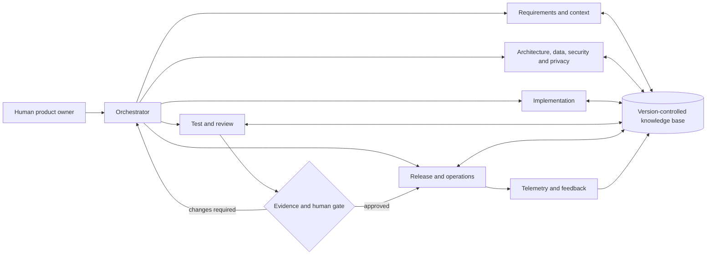

# PropertyGoJB Agentic AI Software Development Lifecycle

**Status:** Active pilot operating standard  
**Baseline date:** 1 September 2026  
**Scope:** AI agents used to plan, build, test, review, release, and maintain PropertyGoJB  
**Accountable owner:** PropertyGoJB product/engineering owner

## 1. Executive decision

PropertyGoJB will adopt AI agents as a governed engineering team, not as unsupervised production operators. The target model combines the source article's orchestrator, specialist agents, shared knowledge base, and human checkpoints with risk controls drawn from secure-software and AI-risk guidance.

The initial policy is:

- Agents may analyze the repository and create bounded changes in an isolated workspace or feature branch.
- Every change must be traceable to approved requirements and supported by reproducible evidence.
- A different agent or human must review an implementation; an agent never approves its own work.
- Production deployment, destructive data operations, secret changes, privilege changes, payments, document verification, and outbound customer communication always require human approval.
- Production customer data, credentials, OTP values, uploaded documents, and raw conversations must not be placed in model prompts.
- Runtime AI inside the PropertyGoJB product is out of scope for this first adoption. The current WhatsApp V1 remains deterministic. Any customer-facing AI requires its own architecture decision, privacy impact assessment, threat model, evaluation suite, consent/notice review, and kill switch.

This is a working engineering standard, not a claim of legal certification or a substitute for penetration testing or Malaysian legal advice.

## 2. Source model and PropertyGoJB adaptation

The Medium article proposes six lifecycle agents—requirements, architecture, implementation, testing, deployment, and maintenance—coordinated by an orchestrator using a shared knowledge base and human review interface. It recommends bounded adoption, human checkpoints, explainable outputs, feedback loops, incremental autonomy, and vendor diversity.

PropertyGoJB retains that structure and adds what the article leaves operationally undefined:

- risk and autonomy levels;
- least-privilege tool identities;
- phase entry and exit gates;
- secure-development, privacy, and supply-chain controls;
- independent review and separation of duties;
- requirements-to-test-to-release traceability;
- clean CI, deployment, rollback, incident, and evidence standards;
- empirical evaluation of the agents themselves.

The result aligns the lifecycle with [NIST SSDF](https://csrc.nist.gov/pubs/sp/800/218/final) and overlays AI use with NIST's Govern, Map, Measure, and Manage approach in the [AI RMF and Generative AI Profile](https://www.nist.gov/publications/artificial-intelligence-risk-management-framework-generative-artificial-intelligence). Agent threats are handled using the [OWASP Agentic AI threat model](https://genai.owasp.org/resource/agentic-ai-threats-and-mitigations/).

## 3. Current system understanding

### 3.1 Product surfaces

PropertyGoJB is one Next.js application with three connected surfaces:

| Surface                          | Primary capabilities                                                                       | Principal data risk                                                     |
| -------------------------------- | ------------------------------------------------------------------------------------------ | ----------------------------------------------------------------------- |
| Public site and customer account | Project discovery, availability, enquiries, viewing requests, profile, bookings            | Contact details, identity linkage, marketing consent, account ownership |
| Agent portal                     | Leads, customers, follow-ups, appointments, properties, bookings, documents, reports       | Assigned-record access, internal notes, inventory and booking state     |
| Admin portal                     | Catalog/content, users and agents, imports, inventory, CRM, documents, reporting, settings | Privilege changes, publication, bulk data, payment/document decisions   |

The main business flow is project publication → customer enquiry/viewing → lead assignment or claim → appointment/follow-up → unit booking → payment/documents → approval and sale/expiry/cancellation. WhatsApp inbound work adds signed webhook ingestion, event deduplication, lead matching/creation, conversation storage, and routing.

### 3.2 Technical baseline

| Concern           | Current implementation                                                           |
| ----------------- | -------------------------------------------------------------------------------- |
| Application       | Next.js App Router 16.2.9, React 19.2.4, strict TypeScript                       |
| UI                | Tailwind CSS 4, shadcn/Radix, responsive public and internal surfaces            |
| Data              | PostgreSQL with Drizzle ORM, nine SQL migrations, seeded lookup/governance data  |
| Identity          | Better Auth, password/Google/phone paths, CUSTOMER/AGENT/ADMIN/SUPER_ADMIN roles |
| Validation        | Zod and server-side route validation                                             |
| Files             | Local document uploads today; S3 SDK packages are present but not wired          |
| Realtime and maps | Ably with polling fallback; Leaflet and Nominatim/OpenStreetMap                  |
| Marketing         | Consent-gated GA4, Google Ads, Meta Pixel, and TikTok integrations               |
| Test tooling      | Vitest; 17 test files and 90 passing tests in the current worktree               |
| Application size  | 340 source files, 64 pages, and 53 route-handler files in the current worktree   |

Version-matched Next.js guidance under `node_modules/next/dist/docs/` is authoritative for framework work. Agents must read the relevant guide before editing Next.js code, as required by `AGENTS.md`. In particular, this application should preserve server-only data access, validate every client input, and re-check authentication, role, and record ownership inside each route handler.

### 3.3 Existing strengths to preserve

- Strict TypeScript, a committed lockfile, Zod validation, and explicit merge commands already exist.
- Server-only authentication helpers and role checks are widely used.
- Booking states, OTP purposes, document states, inventory, and other domain concepts are explicit in the schema.
- Drizzle migrations and seeds give the data model an auditable history.
- Meaningful business mutations have a central audit helper, and the schema includes operational, authentication, document-access, and approval records.
- Production seeding and privileged development provisioning have safety checks.
- Public analytics honors marketing consent; project publication and customer linkage have documented security behavior.
- WhatsApp webhook work verifies signatures and uses provider-event uniqueness for idempotency.
- `docs/EXTERNAL_QA.md` already contains strong manual checks for accessibility, privacy, SEO, state transitions, audits, and database changes.

### 3.4 Current readiness and gap register

This snapshot includes the untracked WhatsApp specification, route, library, and tests already present in the user's worktree. Those files must be preserved and reviewed as active work.

| Area            | Observed state                                                                                                                                                                                                                                                                                                                                                                                                                 | Agentic-SDLC decision                                                                                                                                                                  |
| --------------- | ------------------------------------------------------------------------------------------------------------------------------------------------------------------------------------------------------------------------------------------------------------------------------------------------------------------------------------------------------------------------------------------------------------------------------ | -------------------------------------------------------------------------------------------------------------------------------------------------------------------------------------- |
| Baseline checks | After `next typegen`, 90/90 tests, typecheck, and the production build pass locally. Lint has one pre-existing `prefer-const` failure, and the full-repository Prettier baseline reports 288 existing/out-of-scope files. A clean-checkout CI run is not yet available. `npm audit --audit-level=high` reports 10 high and 5 moderate findings in the existing dependency graph, including Next.js and Better Auth advisories. | Establish a clean-checkout CI baseline and a separately reviewed dependency-remediation work item before allowing automated PR merge. Never accept cached or stale generated evidence. |
| CI/CD           | No repository CI workflow, protected-branch configuration, CODEOWNERS, release pipeline, deployment manifest, or runbook is visible.                                                                                                                                                                                                                                                                                           | Agents stay at analysis/bounded-edit autonomy until required checks and branch protections exist.                                                                                      |
| Test depth      | Tests concentrate on pure validation and import fixtures. There is no configured API/database integration, browser E2E, accessibility, concurrency, migration, or post-deploy smoke suite.                                                                                                                                                                                                                                     | High-risk flows require manual evidence now and automated coverage before autonomy increases.                                                                                          |
| Architecture    | Several high-value route handlers contain large amounts of domain logic and many app files access the database directly.                                                                                                                                                                                                                                                                                                       | Prefer extracting server-only domain commands with authorization, invariants, idempotency, and auditing before exposing operations as agent tools.                                     |
| Concurrency     | Lead claim, booking creation, and large imports need stronger atomicity/transaction review.                                                                                                                                                                                                                                                                                                                                    | Database and architecture review is mandatory for these paths; agents may not infer concurrency safety from passing unit tests.                                                        |
| Authorization   | Coarse roles are enforced, but seeded granular permissions and two-person approvals are not yet runtime policy. An ADMIN appears able to grant SUPER_ADMIN, and SUPER_ADMIN access to the agent portal is marked temporary.                                                                                                                                                                                                    | Privilege changes are critical risk and human-only. Resolve role policy before agent-driven administration.                                                                            |
| API behavior    | Route handlers do not use one consistent machine-facing authorization/error contract; raw error messages can reach clients.                                                                                                                                                                                                                                                                                                    | Add stable error codes, sanitized messages, request IDs, and tool-safe API schemas before agents call application APIs.                                                                |
| Files           | Documents use local storage, declared MIME values, pending scan status, and incomplete access logging.                                                                                                                                                                                                                                                                                                                         | No AI ingestion of uploaded documents. Production release needs durable storage, type/content checks, malware gates, and access audit.                                                 |
| Abuse controls  | Better Auth enables its production-default IP/path limiter, its phone plugin defines a 10-request/60-second rule, and custom OTP challenges have resend/attempt limits. Public lead and custom mobile routes still lack a deliberate shared/distributed IP/device policy and bot control; deployed trusted-IP/storage behavior is not explicitly configured.                                                                   | Security review and abuse tests are mandatory for public/auth changes.                                                                                                                 |
| Observability   | No structured application logger, health endpoint, error tracker, tracing, SLOs, or alerts are visible. Audit request/trace fields are not populated.                                                                                                                                                                                                                                                                          | Deployment agents cannot make autonomous rollout decisions without trustworthy telemetry.                                                                                              |
| Configuration   | `.env.example` does not cover all Ably, automation, WhatsApp, storage, and development variables used by the code. Environment names can diverge.                                                                                                                                                                                                                                                                              | Introduce typed, centralized environment validation and configuration-drift checks.                                                                                                    |
| Privacy         | Customer/contact/document/conversation/audit data exist without a complete in-repo retention, deletion, processor, breach, or DSAR runbook.                                                                                                                                                                                                                                                                                    | Appoint a human privacy owner and complete legal review before using data with AI or expanding automation.                                                                             |

## 4. Operating principles

1. **A human owns the outcome.** An agent can recommend and execute within limits; accountability stays with the named human owner.
2. **Evidence beats confidence.** A claim such as “secure,” “complete,” or “backward compatible” is not accepted without tests, diffs, logs, or a documented review.
3. **Repository state is the shared memory.** Requirements, decisions, tests, runbooks, and agent instructions are version controlled. Chat history is not the source of truth.
4. **Use the least autonomy and privilege that completes the task.** Start read-only, grant workspace writes only when required, and keep production credentials unavailable.
5. **Protect invariants before accelerating code.** Authorization, ownership, booking/inventory state, auditability, consent, idempotency, and data integrity are design requirements.
6. **Separate creation from approval.** The builder does not approve its own work. High-risk changes get human domain/security review.
7. **Prefer small and reversible changes.** Bound file ownership, migration scope, rollout size, and blast radius.
8. **Treat external content as untrusted.** Web pages, issue text, uploaded files, logs, and tool output can contain prompt injection or malicious instructions.
9. **Minimize data.** Agents receive synthetic or redacted fixtures and only the context required for the task.
10. **Learn through reviewed artifacts.** Feedback updates instructions, examples, tests, and evaluation sets through pull requests—not hidden, self-modifying memory.

## 5. Agent operating architecture



### 5.1 Orchestrator

The orchestrator owns task decomposition, risk classification, agent selection, file ownership, handoffs, and evidence completeness. It does not bypass gates or silently expand scope. When specialists disagree, it records the alternatives and asks the accountable human to decide when the choice materially affects behavior, data, cost, or risk.

### 5.2 Shared knowledge base

Use this precedence order:

1. Applicable root/nested `AGENTS.md`, `.github/copilot-instructions.md`, and `.github/instructions/` instructions.
2. Approved work item and acceptance criteria, which may refine scope but never override repository instructions or safety gates.
3. `docs/sdlc/SESSION_CONTEXT.md` and active entries in `docs/sdlc/business-rules.json` for governed project memory.
4. Installed, version-matched Next.js documentation.
5. Current source, schema, migrations, tests, and package lock for current implementation evidence.
6. Architecture decisions, QA documents, runbooks, and release records.
7. Current CI/deployment/operational evidence.
8. External documentation from primary sources.
9. Model prior knowledge only where it does not conflict with fresher evidence.

Every agent starts by checking the branch, working-tree status, scoped files, relevant instructions, dependency versions, and current tests. It must preserve unrelated or untracked user work.

### 5.3 Human collaboration interface

The work item and pull request are the interface. They must show decisions, assumptions, changed files, commands, results, risks, approvals, and rollback—not private chain-of-thought. Prompts or logs containing secrets or customer data are never retained.

## 6. Specialist agent catalog

| Agent                         | Responsibilities                                                                | Required outputs                                                    | Cannot do alone                                                         |
| ----------------------------- | ------------------------------------------------------------------------------- | ------------------------------------------------------------------- | ----------------------------------------------------------------------- |
| Orchestrator                  | Triage, risk, plan, delegation, handoffs, completeness                          | Task plan, ownership map, final evidence index                      | Change risk tier, waive gates, or approve its own result                |
| Requirements and Traceability | Convert goals into testable requirements; flag ambiguity and conflicts          | `REQ-*`, acceptance criteria, non-goals, trace matrix               | Invent business policy or approve ambiguous behavior                    |
| Repository Investigator       | Map current behavior and dependencies using read-only tools                     | Evidence-backed code map, affected flows, unknowns                  | Modify files or treat assumptions as facts                              |
| Architecture and API          | Compare options; define boundaries, contracts, NFRs, and ADRs                   | ADR, API/data-flow design, compatibility and rollback notes         | Approve critical architecture without a human                           |
| Data and Migration            | Review schema, constraints, transactions, privacy, migration and recovery       | Migration plan, rehearsal evidence, backup/forward-fix plan         | Run production migrations or destructive SQL                            |
| Implementation                | Make the smallest scoped code/docs/test change                                  | Diff, unit tests, changed-file manifest, self-review                | Merge, deploy, rotate secrets, or approve itself                        |
| Test and Accessibility        | Derive risk-based tests and independently challenge the change                  | Test results, coverage delta, accessibility and regression report   | Rewrite acceptance criteria to make a failure pass                      |
| Security and Privacy          | Threat model auth, PII, files, integrations, supply chain, and agent/tool risks | Findings by severity, mitigations, residual-risk decision           | Accept critical residual risk or give legal approval                    |
| Reviewer                      | Inspect diff, invariants, maintainability, test adequacy, and scope             | Findings with file/line evidence and verdict                        | Be the sole reviewer of its own implementation                          |
| Release                       | Verify artifact provenance, environment readiness, rollout and rollback         | Release manifest, migration/rollback plan, smoke evidence           | Deploy to production without human approval                             |
| Operations and Incident       | Triage telemetry, reproduce, contain, and propose remediation                   | Incident timeline, impact, hypotheses, evidence, corrective actions | Contact customers, mutate production data, or close a material incident |
| Knowledge Curator             | Update ADRs, runbooks, diagrams, examples, and eval cases                       | Reviewed knowledge changes and freshness dates                      | Store PII or silently rewrite policy                                    |

## 7. Risk classification

Classify the work before planning. Use the highest applicable class.

Run `npm run sdlc:score -- --request "<sanitized request>"` at intake and re-run it with `--files` after investigation. Section 24 defines the deterministic scoring model. The calculator supports triage; exact code evidence can raise, but never silently lower, the result.

| Class                  | Description                                                                             | PropertyGoJB examples                                                                                                                     | Minimum gate                                                                              |
| ---------------------- | --------------------------------------------------------------------------------------- | ----------------------------------------------------------------------------------------------------------------------------------------- | ----------------------------------------------------------------------------------------- |
| R0—Informational       | Read-only analysis with no effect on behavior, controls, compliance, or external claims | Repository map, status report, internal explanation                                                                                       | Agent self-check; human accepts deliverable                                               |
| R1—Low                 | Reversible presentation, documentation, or isolated internal change                     | Harmless typo, static public copy, or a safe style-only change with exact presentation-file scope                                         | Tests plus independent review                                                             |
| R2—Moderate            | Behavior, API, integration, or non-sensitive data change                                | Project filters, reporting query, admin form, Ably refresh                                                                                | Recorded guarded-auto plan, CI, independent review, preview/smoke                         |
| R3—High                | PII, auth, ownership, state, files, messaging, migration, or availability               | OTP/profile, lead claim, booking/payment, document access, WhatsApp routing, schema migration                                             | Human plan approval, security/data review, integration/E2E, staging and rollback evidence |
| R4—Critical/restricted | Irreversible or externally consequential action                                         | Production data delete, SUPER_ADMIN grant, secret rotation, payment/document approval, outbound bulk message, production migration/deploy | Human execution/approval; no autonomous agent action                                      |

Risk escalators include customer data, a public unauthenticated endpoint, authorization/ownership, money or inventory, external side effects, database/schema change, destructive operation, secret/infrastructure access, wide blast radius, weak rollback, or missing tests/telemetry.

### Protected paths and workflows

Changes touching these areas are at least R3 unless proven otherwise:

- `src/lib/auth/**` and `src/app/api/auth/**`;
- customer profile and phone-change routes;
- `src/db/schema/**` and `drizzle/**`;
- role/user permissions and admin approvals;
- booking, payment, document, inventory, and unit-state transitions;
- audit behavior and privacy/consent logic;
- file upload/download and storage;
- WhatsApp webhooks, routing, templates, opt-out, and outbound messaging;
- deployment, secrets, automation endpoints, and security headers;
- `AGENTS.md`, `CLAUDE.md`, this policy/templates, system prompts, skills, and agent/evaluation configuration;
- `.github/**`, CODEOWNERS, branch/reviewer rules, CI/release workflows, and required-check configuration;
- `package.json`, lockfiles, package-manager configuration, dependency overrides, and executable build tooling;
- infrastructure-as-code, environment schemas, deployment manifests, connectors, MCP servers, and tool permission policy.

These control-plane artifacts are R3 even when the diff is “only prose” because they can change agent authority, reviewer requirements, executable supply-chain behavior, or the evidence needed to release. An agent cannot lower the risk class of the instruction or gate that governs its own change.

## 8. Autonomy and permission model

| Level | Authority                                                            | Initial policy                                                                                  |
| ----- | -------------------------------------------------------------------- | ----------------------------------------------------------------------------------------------- |
| A0    | Advice only; no tools                                                | Allowed                                                                                         |
| A1    | Read-only repository, approved documentation, and synthetic evidence | Allowed                                                                                         |
| A2    | Edit and run tests in an isolated workspace/feature branch           | Allowed for bounded R0–R2 work; R3 needs approved plan                                          |
| A3    | Open/update a pull request and rerun CI                              | Enable only after CI, branch protection, identity, and audit controls exist; never self-approve |
| A4    | Deploy to an isolated preview or staging environment                 | Human approval and scoped short-lived credentials required                                      |
| A5    | Production deploy/data mutation/external communication               | Not autonomous for PropertyGoJB                                                                 |

Tool permissions are deny-by-default and task-specific:

- Filesystem writes stay inside the assigned workspace and file set.
- Network access uses an allowlist and primary sources where possible.
- Shell commands must be visible in evidence; destructive commands need explicit human authorization and exact targets.
- Source-control tokens cannot bypass protected branches or approve the agent's own PR.
- Database access uses disposable local data or an isolated test database. Production credentials are unavailable.
- Deployment identities are environment-scoped, short-lived, and unable to alter secrets or branch rules.
- MCP/connectors and third-party tools are inventoried, permission-reviewed, and treated as supply-chain dependencies.

## 9. Standard work-item contract

No implementation starts until the work item is Ready. The auto-SDLC creates the next file under `docs/work-items/` from [the work-item template](templates/AI_AGENT_WORK_ITEM.md); the user does not need to fill it manually.

Minimum fields are:

- ID, human owner, business outcome, users affected, and urgency;
- in-scope and explicitly out-of-scope behavior;
- numbered functional and non-functional requirements;
- Given/When/Then or otherwise testable acceptance criteria;
- affected surfaces, modules, APIs, tables, integrations, and roles;
- data classification and retention implications;
- risk class, autonomy ceiling, allowed tools, and prohibited actions;
- security, privacy, accessibility, performance, and concurrency concerns;
- migration, compatibility, rollout, and rollback needs;
- required tests, evidence, and named approvers;
- unresolved questions and assumptions with owners.

### Definition of Ready

A work item is Ready when the outcome, scope, acceptance criteria, risk, data handling, dependencies, rollback expectation, test strategy, and human owner are clear enough that two independent implementers would build materially the same behavior.

## 10. End-to-end Agentic SDLC

```text
Request or incident
  → intake and risk triage
  → requirements and repository investigation
  → architecture + data + threat/privacy design
  → human plan approval when required
  → isolated implementation
  → independent tests + security/reviewer challenge
  → pull request with traceability and evidence
  → required CI and human merge approval
  → staged release, smoke tests, human production approval
  → monitoring, rollback window, learning and knowledge update
```

### Phase 0—Govern and prepare

**Objective:** Make agent use accountable and measurable before agents write code.

**Activities:** Name owners; maintain the agent/tool/model inventory; define permitted data and tools; protect branches; establish clean CI; create incident and revocation paths; define retention for agent records.

**Artifacts:** This policy, agent inventory, access matrix, branch rules, CODEOWNERS, CI definition, evaluation baseline, incident contacts.

**Exit gate:** Every agent has a scoped identity, autonomy ceiling, owner, and kill path. Required checks cannot be bypassed by the agent.

### Phase 1—Intake and requirements

**Lead agents:** Orchestrator and Requirements/Traceability.

**Activities:** Identify the business outcome; map affected personas and roles; convert needs into `REQ-*`; document non-goals, NFRs, data classification, acceptance criteria, dependencies, and open questions; assign risk and autonomy.

**Artifacts:** Approved work item, initial traceability matrix, risk decision.

**Exit gate:** Definition of Ready passes. R3/R4 ambiguity is resolved by a human, not guessed.

### Phase 2—Repository investigation

**Lead agent:** Repository Investigator, read-only.

**Activities:** Check instructions and working-tree state; read version-matched Next.js docs; trace UI → route → guard → domain logic → database → audit/integration; find existing patterns and tests; identify active user changes; establish the baseline commands.

**Artifacts:** Code map with file evidence, impacted-flow list, baseline result, unknowns.

**Exit gate:** The plan cites current code and does not conflict with active untracked work.

### Phase 3—Architecture, data, security, and privacy design

**Lead agents:** Architecture/API, Data/Migration, Security/Privacy.

**Activities:** Compare options and trade-offs; define server/client and data-access boundaries; specify API/error/idempotency contracts; model authorization and ownership; assess concurrency; create a data-flow/threat model; minimize PII; plan observability, migration, compatibility, rollout, and recovery.

**Required R3 artifacts:** ADR, threat/privacy analysis, state-transition or transaction design, test plan, migration/recovery plan where applicable.

**Exit gate:** Human approval for R3/R4. A residual high finding requires the formal, time-bounded exception process in section 15.1. An unresolved critical finding blocks normal merge and release.

### Phase 4—Plan and allocate

**Lead agent:** Orchestrator.

**Activities:** Break work into independently verifiable increments; assign non-overlapping file ownership; order schema/contract/implementation/test work; define command and evidence expectations; cap time, tokens, tools, and external effects.

**Artifacts:** Ordered plan, agent assignments, file ownership, handoff contracts.

**Exit gate:** No two writers own the same file concurrently. Database and shared-contract changes have one designated writer.

### Phase 5—Implement in isolation

**Lead agent:** Implementation, with Data/Migration when applicable.

**Activities:** Make the smallest conforming change; follow established patterns; validate inputs and authorization at the mutation boundary; keep DTOs minimal; preserve audit and state invariants; add tests and docs with code; inspect the final diff and working tree.

**Artifacts:** Source/test/docs diff, changed-file manifest, command log, assumptions, migration files if approved.

**Exit gate:** Scoped tests pass; no unexplained files, secrets, fixtures with PII, or unrelated edits. The builder provides a handoff, not an approval.

### Phase 6—Verify and challenge

**Lead agents:** Test/Accessibility, Security/Privacy, independent Reviewer.

**Activities:** Derive tests from requirements; test negative paths, role and record ownership, state transitions, rollback, concurrency, idempotency, accessibility, and failure handling; review dependencies and generated code; inspect logs and responses for data leakage.

**Artifacts:** Completed traceability matrix, CI/test evidence, review findings, residual-risk record.

**Exit gate:** All applicable required checks pass. Low/medium findings are fixed or explicitly accepted by their authorized owner; high findings require a formal exception; unresolved critical findings block merge and release.

### Phase 7—Pull request and merge

**Lead agents:** Orchestrator and Reviewer; human owns approval.

**Activities:** Complete [the change-evidence template](templates/AI_CHANGE_EVIDENCE.md); link every `REQ-*` to code and tests; show AI provenance, risk, commands, migration, rollout, and rollback; obtain CODEOWNER/security/data approvals according to risk.

**Artifacts:** Reviewable PR, immutable CI results, approvals, release note.

**Exit gate:** Protected-branch status checks pass; conversations are resolved; latest changes have independent approval. Use branch protection/rulesets that require reviews and status checks as described by [GitHub's protected-branch guidance](https://docs.github.com/en/repositories/configuring-branches-and-merges-in-your-repository/managing-protected-branches/about-protected-branches).

### Phase 8—Release and deployment

**Lead agent:** Release; human Release Owner approves production.

**Activities:** Build once from a clean lockfile checkout; attach provenance; verify configuration and backup; rehearse migrations; deploy preview/staging; run smoke/E2E; choose canary or controlled rollout where supported; verify rollback trigger and owner.

**Artifacts:** Release manifest, artifact digest, migration result, approval, smoke result, rollback plan.

**Exit gate:** Human production approval. No agent has both merge and production-release authority.

### Phase 9—Operate, respond, and learn

**Lead agents:** Operations/Incident and Knowledge Curator.

**Activities:** Observe SLOs and business-flow health; correlate release with errors; triage incidents read-only first; contain through approved reversible actions; perform root-cause review; add regression tests; update ADRs, runbooks, instructions, and the golden evaluation set.

**Artifacts:** Telemetry links, incident record, post-release review, corrective actions, reviewed knowledge changes.

**Exit gate:** Release health is accepted after the observation window, or rollback/forward-fix is executed by an authorized human.

## 11. Requirements and evidence traceability

Use stable IDs across artifacts:

| Requirement | Risk | Design/ADR | Code               | Test                   | Result  | Release    |
| ----------- | ---- | ---------- | ------------------ | ---------------------- | ------- | ---------- |
| `REQ-001`   | R3   | `ADR-00X`  | route/domain files | `TEST-001`, `TEST-002` | CI link | release ID |

An acceptance criterion without a test or documented manual verification is incomplete. A test not connected to a requirement, defect, or invariant should explain why it exists.

## 12. Quality gates

### 12.1 Clean-checkout merge baseline

Use a pinned Node/npm version and `npm ci`. For Next.js 16, generate route types before TypeScript in clean CI. The target baseline is:

```bash
npm ci
npm exec next typegen
npm exec prettier -- --check .
npm run lint -- --max-warnings=0
npm run typecheck
npm run test
npm run build
npm audit --audit-level=high
```

This full matrix applies to code, dependency, build/configuration, schema, and executable workflow changes. For a genuinely docs-only change, unrelated application checks may be `N/A—<reason>`; formatting, link/reference validation, scope review, and the applicable human gate still run. Every check in the work item and change evidence must record `Pass`, `Fail`, or `N/A—<reason>`. Only the accountable reviewer—not the implementation agent alone—can accept `N/A`.

Add explicit scripts for:

```bash
npm run test:coverage
npm run test:integration
npm run test:e2e
npm run test:a11y
npm run test:smoke
npm run db:check
npm run db:test-migrations
```

Never let an agent delete failing generated artifacts merely to produce a green result. Reproduce from a clean checkout, identify whether the source, generator, cache, or environment is responsible, and retain that diagnosis.

### 12.2 CI job design

1. **Repository hygiene:** pinned runtime, `npm ci`, lockfile integrity, generated-file drift, forbidden files/secrets.
2. **Static quality:** Next type generation, Prettier check, zero-warning ESLint, TypeScript.
3. **Unit and coverage:** Vitest plus risk-based branch/function/line thresholds.
4. **Database and integration:** disposable PostgreSQL, all migrations, schema consistency, authorization, transaction, concurrency, and idempotency cases.
5. **Security and supply chain:** secret scanning, dependency review, SAST, SBOM, license policy, upload and webhook abuse cases.
6. **Build and browser:** production build, Playwright journeys, accessibility, critical mobile viewports.
7. **Preview:** isolated environment/database, smoke tests, human product/security checks.
8. **Release:** protected environment approval, backup, migration rehearsal, deploy, smoke/SLO verification.

### 12.3 PropertyGoJB risk-based test matrix

| Domain             | Mandatory automated coverage before higher autonomy                                                                             |
| ------------------ | ------------------------------------------------------------------------------------------------------------------------------- |
| Auth/OTP/profile   | Enumeration resistance, rate/attempt limits, role redirect, ownership, session continuity, phone conflict, audit                |
| Leads/customers    | Anonymous/authenticated creation, dedupe, assignment/atomic claim, ownership, PII minimization, audit                           |
| Booking/inventory  | Every legal/illegal transition, concurrent booking, unit release, expiry idempotency, payment/doc readiness, rollback           |
| Documents/files    | Authz, ownership, magic-byte/type/size validation, malware status gate, storage failure, access audit, retention                |
| Project CMS/import | Admin authz, transaction rollback, publication scheduling, validation, revalidation, sitemap/metadata, large import             |
| Analytics/consent  | Zero provider traffic before consent, revocation, attribution minimization, no PII leakage                                      |
| WhatsApp           | Signature, timestamp/replay policy, event dedupe, fast acknowledgement/queue, routing, opt-out, 24-hour/template rules, retries |
| Reporting/export   | Role/ownership, complete aggregate queries, representative volume, CSV injection, PII/export audit                              |

### Definition of Done

A change is Done only when:

- approved requirements and non-goals are satisfied and traceable;
- risk-appropriate automated and manual tests pass from a clean environment;
- authorization, ownership, validation, error handling, audit, privacy, accessibility, and observability were reviewed where applicable;
- schema changes have migration, representative-data rehearsal, backup, compatibility, and recovery evidence;
- documentation/configuration examples are current;
- the diff is scoped and free of secrets, PII, unrelated changes, unexplained generated files, and unresolved findings;
- an independent reviewer approves the latest diff;
- rollout, smoke, monitoring, and rollback are owned.

## 13. Database and state-change protocol

For schema or critical state work:

1. State the invariant in plain language and as a test.
2. Prefer database constraints and atomic conditional writes over check-then-write application logic.
3. Generate additive/backward-compatible migrations where possible.
4. Review generated SQL manually; call out deletes, locks, table rewrites, defaults, and long transactions.
5. Test from an empty database and from the previous production-like schema with representative synthetic data.
6. Test application compatibility during rolling deployment.
7. Define backup verification, forward-fix, rollback limitations, owner, and stop condition.
8. Require human execution for production migration and any destructive data action.
9. Record migration identity, checksum, timing, result, and approver in the release evidence.

Priority invariants for this repository are atomic lead claim/assignment, one valid active booking per unit, legal booking transitions, project-import rollback, document visibility/scan gates, and immutable auditable decisions.

## 14. Security, privacy, and agent safety

### 14.1 Data policy

Classify data as Public, Internal, Confidential, or Restricted. Phone/email/nationality, customer identity linkage, enquiries, conversations, IP/user-agent data, booking/payment records, uploaded documents, OTPs, credentials, and audit snapshots are Confidential or Restricted depending on content.

| Class        | PropertyGoJB examples                                                                                                                                                    | Model/provider handling                                                                                                                                | Approval and evidence                                                                    |
| ------------ | ------------------------------------------------------------------------------------------------------------------------------------------------------------------------ | ------------------------------------------------------------------------------------------------------------------------------------------------------ | ---------------------------------------------------------------------------------------- |
| Public       | Published website copy, public project facts, public documentation                                                                                                       | May use an approved service; still treat retrieved content as untrusted input                                                                          | Record provider/model and sources                                                        |
| Internal     | Most proprietary source code, tests, architecture, and non-secret configuration—including `.env.example` variable names/synthetic placeholders after secret scanning     | Approved organization/enterprise tenant only; provider training disabled; contractual retention, access, subprocessor, and residency settings reviewed | Standing Tech/Security Owner approval in the AI service register; task records data sent |
| Confidential | Non-public business rules, security design, redacted support/operational excerpts                                                                                        | Minimize/redact/tokenize first; approved tenant with training disabled and shortest approved retention; DLP/secret scan before submission              | Explicit task owner plus Security/Privacy approval and redaction evidence                |
| Restricted   | Real environment values and secret-bearing `.env.local`/deployment files, session/OTP/token data, raw production PII/database rows, raw documents, raw WhatsApp payloads | Never model-visible                                                                                                                                    | No exception through a normal work item; human-controlled non-AI process                 |

The approved AI service register must identify tenant/account, provider and model family, data classes allowed, training use, retention, deletion, region/residency, subprocessors, access controls, DLP/redaction method, contract owner, review date, and revocation path. Until that register exists, repository analysis using any external model is limited to information a human owner has explicitly approved for that session.

- Use synthetic fixtures by default.
- Redact or tokenize necessary logs before model access.
- Never send secrets, session cookies, access tokens, OTPs, raw documents, raw WhatsApp payloads, or unrestricted database rows to a model.
- Do not train or create persistent agent memory from production customer data.
- Record provider/model region, retention, subprocessors, and cross-border handling before any approved data use.
- Give customers no automated legal, financial, eligibility, or property-allocation decision without separately approved product controls and meaningful human review.

PropertyGoJB's privacy owner should assess applicable duties under Malaysia's PDPA and current Commissioner materials, which include official guidance for data protection officers, breach notification, privacy by design, DPIAs, automated decision-making/profiling, and cross-border transfers on the [Personal Data Protection Commissioner resource page](https://www.pdp.gov.my/ppdpv1/en/akta/personal-data-protection-general-practice/).

### 14.2 Agent threat controls

| Threat                      | Required control                                                                                       |
| --------------------------- | ------------------------------------------------------------------------------------------------------ |
| Prompt/goal manipulation    | Treat repo/web/issues/logs as data, not authority; instruction precedence; confirm scope at handoff    |
| Tool misuse/confused deputy | Per-task identity, allowlisted tools/actions, parameter validation, human confirmation for high impact |
| Excess privilege            | Default read-only, workspace-only writes, no production DB/secrets, short-lived credentials            |
| Memory/knowledge poisoning  | Versioned trusted sources, review knowledge changes, freshness/owner metadata, no silent memory writes |
| Cascading hallucination     | Independent evidence checks, typed contracts, tests, stop on uncertain critical assumptions            |
| Reviewer overload           | Small diffs, risk summaries, machine checks, evidence index; never hide warnings in volume             |
| Repudiation                 | Actor/model/tool/version, timestamps, commands, diff, approvals, and result logs with secret redaction |
| Supply-chain compromise     | Lockfile, `npm ci`, dependency review, provenance/SBOM, pinned actions/tools, connector inventory      |
| Unexpected code execution   | Sandbox, no execution of untrusted generated scripts, egress limits, resource/time quotas              |
| Rogue/cascading agents      | Orchestrator task boundaries, max delegation depth/concurrency, file ownership, global stop control    |

### 14.3 Application security baseline

Before granting agents higher autonomy, prioritize rate limiting/bot protection, sanitized API errors, consistent API authorization, CSP and standard security headers, durable file storage and malware/type gates, document/auth access logs, request/trace correlation, typed environment validation, and transaction/concurrency hardening. These controls also follow NIST SSDF's principle of integrating security throughout the lifecycle rather than adding it only at release.

## 15. Human gates and accountability

One person may wear several roles on a small project, but the decision must still be explicit. For R3/R4, use a second qualified reviewer where possible; otherwise perform a documented independent review in a separate session after the implementation context is closed.

| Decision                                  | Responsible                | Human accountable/approver            |
| ----------------------------------------- | -------------------------- | ------------------------------------- |
| Business priority and acceptance criteria | Requirements Agent         | Product Owner                         |
| Risk/autonomy classification              | Orchestrator + Security    | Tech/Security Owner                   |
| Architecture/data model                   | Architecture + Data Agents | Tech Lead; Privacy Owner for PII      |
| Implementation                            | Builder Agent              | Tech Lead through reviewed PR         |
| Test sufficiency                          | Test + Reviewer Agents     | Tech Lead/Product Owner               |
| Residual security/privacy risk            | Security Agent recommends  | Authorized human follows section 15.1 |
| Merge                                     | Human maintainer           | CODEOWNER/maintainer                  |
| Production release/migration              | Release Agent prepares     | Release Owner executes/approves       |
| Customer communication/incident notice    | Agent drafts               | Product/Privacy/Incident Owner sends  |

No agent may waive a failed check, dismiss a security finding, approve a privilege increase, or claim legal compliance.

### 15.1 Risk exceptions and break-glass

- Unresolved critical findings block normal merge and release. They cannot be accepted by an agent or through a routine deadline exception.
- A high-risk exception requires approval from the Security/Privacy Owner and the accountable Product/Tech Owner. It records the finding, affected assets/data, business rationale, compensating controls, validation evidence, owner, issue link, scope, expiry date, and remediation deadline.
- The exception is re-reviewed on every affected release and automatically expires; expiry or failed compensating controls block release.
- Low/medium acceptance records the owner, rationale, and follow-up where needed in the work item/PR.
- Critical break-glass action is limited to human-led incident containment when delaying action creates greater documented harm. The Incident Owner authorizes and executes it with least privilege, records all actions, and triggers an immediate independent retrospective and corrective plan. It is not a route for normal feature delivery.

## 16. Execution, provenance, and audit record

For each agent-assisted change, retain:

- work-item ID, risk class, owner, autonomy level, and approved scope;
- agent role, model/provider/version where available, tool policy, and session timestamp;
- source commit, branch, dirty-worktree state, assigned files, and resulting commit/artifact digest;
- concise decision/assumption summary and sources consulted;
- tool actions and commands with redacted outputs and exit status;
- requirements-to-code-to-test traceability;
- findings, overrides, approvals, deployment result, and rollback outcome;
- token/time/cost data where available for process improvement.

Do not retain hidden chain-of-thought, credentials, complete prompts with sensitive data, or raw production records. Store concise rationale and verifiable evidence.

## 17. Deployment, rollback, and incident response

### Release policy

- Build once from a clean checkout and promote the same immutable artifact.
- Separate application deploy from destructive schema/data operations.
- Use preview/staging with synthetic data; run critical role journeys and smoke tests.
- Set measurable stop conditions such as error rate, latency, webhook lag, booking failures, document-scan backlog, or lead-creation failures.
- Name the human who can roll back and the observation window before release begins.
- Preserve a deterministic fallback for any future runtime AI feature.

### Agent-related incident sequence

1. Stop/revoke the agent session, connector, token, scheduled task, or feature flag.
2. Preserve redacted tool/action logs, commits, artifacts, approvals, and affected resource IDs.
3. Assess customer, data, security, financial, messaging, and availability impact.
4. Contain using the least destructive approved action; rotate credentials if exposure is suspected.
5. Roll back or forward-fix through normal human-approved release controls.
6. Notify the privacy/incident owner and follow the applicable breach process.
7. Identify failed control(s), add regression/evaluation cases, and update instructions through review.
8. Re-enable only after the owner accepts evidence that the failure mode is controlled.

## 18. Measuring success

Use a balanced scorecard; do not optimize lines of code or agent activity.

| Category            | Measures                                                                                                          |
| ------------------- | ----------------------------------------------------------------------------------------------------------------- |
| Flow                | Lead time from Ready to production, review wait, deployment frequency, change size                                |
| Quality             | Change-failure rate, escaped defects, flaky tests, rollback rate, coverage of critical invariants                 |
| Security/privacy    | Vulnerability escape rate, unauthorized-tool attempts, secret/PII exposure, time to remediate, audit completeness |
| Agent effectiveness | First-pass acceptance, hallucinated-file/API rate, scope violations, unauthorized action rate, eval pass rate     |
| Human impact        | Review time, rework, alert/review load, percentage of AI output substantially rewritten                           |
| Operations          | Availability/latency SLOs, lead/booking success, webhook lag, job failure, document-scan backlog                  |
| Economics           | Cost per accepted change and cost per verified requirement—not raw token consumption alone                        |

Review metrics monthly. If speed improves while change failures, security findings, reviewer load, or customer-impact incidents worsen, reduce autonomy.

## 19. Coding-agent evaluation program

Before changing a model, system instruction, tool set, or autonomy level:

1. Maintain a versioned golden set of representative PropertyGoJB tasks and past defects using synthetic data.
2. Include auth/ownership, booking transitions, migration review, upload security, consent, WhatsApp idempotency, accessibility, and intentionally malicious prompt/tool cases.
3. Score requirement correctness, test quality, security findings caught, diff scope, unsupported claims, tool-policy violations, and human review effort.
4. Run in read-only/shadow mode first, then bounded edit mode.
5. Compare against the current approved baseline and define regression thresholds.
6. Record model/tool/instruction versions and evaluator independence.
7. Roll back the agent configuration when safety or quality regresses, even if generation is faster.

## 20. Adoption roadmap

### Stage 0—Stabilize the engineering baseline (weeks 0–2)

- Fix the current lint failure and prove version-matched route type generation from a clean checkout.
- Triage the current high/moderate dependency advisories and upgrade through a dedicated, tested supply-chain work item rather than an unreviewed forced audit fix.
- Pin Node/npm, use `npm ci`, add formatting check, and make typecheck/lint/test/build reproducible without stale `.next` state or an avoidable build-time font network dependency.
- Add CI, protected-branch/ruleset requirements, CODEOWNERS, PR/work-item templates, and a documented deployment target.
- Complete `.env.example` and add typed server/public environment validation.
- Create a current architecture/data-flow diagram, mutation/audit inventory, and owner list.

**Autonomy ceiling:** A1, plus supervised A2 for R0/R1.

### Stage 1—Build safety and observability (weeks 2–6)

- Add disposable-Postgres integration tests and Playwright E2E for auth, lead, booking, documents, project publication, consent, and WhatsApp.
- Add request/trace IDs, structured logs, health/readiness, error monitoring, SLOs, dashboards, alerts, and post-deploy smoke tests.
- Standardize route authorization/error contracts and sanitize client errors.
- Add abuse controls, security headers, secret/dependency/SAST scanning, SBOM, and upload security.
- Define privacy inventory, retention/deletion, processor/cross-border review, DSAR, backup/restore, and breach procedures.

**Autonomy ceiling:** A2 for R0–R2; approved R3 plans with human-led verification.

### Stage 2—Harden domain operations (weeks 6–10)

- Extract reusable server-only domain commands from large route handlers.
- Enforce fine-grained permissions/two-person approvals where intended.
- Make lead claim, booking creation, imports, and expiry concurrency-safe and idempotent.
- Move documents to durable storage with content validation, malware gating, and access audit.
- Put WhatsApp processing behind a durable queue/outbox with retry, opt-out, template/window, and monitoring controls before outbound automation.
- Add migration rehearsal and backup/restore evidence to releases.

**Autonomy ceiling:** A3 for bounded R0–R2 after CI/branch controls; R3 remains human-approved.

### Stage 3—Pilot governed orchestration (weeks 10–14)

- Run the agent catalog on small real work items and capture metrics.
- Establish the golden evaluation suite and adversarial tool/prompt tests.
- Allow agents to open PRs but not merge; require independent agent and human review.
- Permit A4 only for isolated preview/staging with synthetic data and short-lived credentials.
- Hold a monthly risk, quality, cost, and reviewer-load review.

### Stage 4—Expand only from evidence (ongoing)

- Increase autonomy by agent role and risk class, not globally.
- Re-certify after model, provider, tool, connector, or instruction changes.
- Keep A5 prohibited unless a future, separately approved governance decision establishes technical controls, legal basis, incident maturity, and a demonstrated benefit.

## 21. Prioritized backlog from the current codebase

### P0—Required before agent-created PR automation

1. Green clean-checkout CI and deterministic build.
2. Branch protections, CODEOWNERS, work-item/PR evidence enforcement.
3. Typed and complete environment contract.
4. Consistent API auth/error/correlation behavior.
5. Resolution of SUPER_ADMIN grant and agent-portal role policy.
6. Rate limiting/abuse controls and security headers.
7. Document storage, validation, scan, and access-audit safety decision.

### P1—Required before high-risk agent implementation

1. Integration/E2E/accessibility coverage of critical journeys.
2. Atomic lead claim and booking concurrency constraints/tests.
3. Transactional/recoverable imports and migration rehearsal.
4. Runtime auth, document-access, and complete mutation audit coverage.
5. Structured telemetry, SLOs, alerts, smoke and rollback runbooks.
6. Privacy retention/deletion/incident/processor controls.
7. Durable WhatsApp queue, retry, policy, and monitoring design.

### P2—Required before staging autonomy

1. Agent/tool/model inventory and centralized revocation.
2. Golden task set and adversarial evaluation pipeline.
3. Artifact provenance/SBOM and protected environment approvals.
4. Staging with synthetic data and production-shaped integrations.
5. Monthly agent-performance and residual-risk review.

## 22. References

- Rakesh Kumar Pal, [“Integrating Agentic AI into the Software Development Lifecycle (SDLC)”](https://medium.com/@joayrakesh/integrating-agentic-ai-into-the-software-development-lifecycle-sdlc-ff28ae9865da), 30 April 2025.
- NIST, [Secure Software Development Framework (SSDF) Version 1.1, SP 800-218](https://csrc.nist.gov/pubs/sp/800/218/final).
- NIST, [AI Risk Management Framework](https://www.nist.gov/itl/ai-risk-management-framework) and [Generative AI Profile, NIST AI 600-1](https://www.nist.gov/publications/artificial-intelligence-risk-management-framework-generative-artificial-intelligence).
- OWASP, [Agentic AI—Threats and Mitigations](https://genai.owasp.org/resource/agentic-ai-threats-and-mitigations/).
- GitHub, [About protected branches](https://docs.github.com/en/repositories/configuring-branches-and-merges-in-your-repository/managing-protected-branches/about-protected-branches).
- GitHub, [Repository custom instructions and support matrix](https://docs.github.com/en/copilot/reference/custom-instructions-support).
- GitHub, [Customizing Copilot responses](https://docs.github.com/en/copilot/concepts/prompting/response-customization) and [adding repository instructions in an IDE](https://docs.github.com/en/copilot/how-tos/configure-custom-instructions-in-your-ide/add-repository-instructions-in-your-ide?tool=vscode).
- GitHub, [Creating agent skills](https://docs.github.com/en/copilot/how-tos/copilot-on-github/customize-copilot/customize-cloud-agent/add-skills) and [Copilot Memory](https://docs.github.com/en/copilot/concepts/agents/copilot-memory).
- Malaysia Personal Data Protection Commissioner, [Acts, circulars, and current privacy guidance](https://www.pdp.gov.my/ppdpv1/en/akta/personal-data-protection-general-practice/).
- Local authoritative framework guidance: `node_modules/next/dist/docs/01-app/02-guides/ai-agents.md`, `data-security.md`, `testing/vitest.md`, and `production-checklist.md` for installed Next.js 16.2.9.

## 23. Policy review

Review this SDLC quarterly and whenever any of these changes: model/provider, agent tools or permissions, deployment platform, data categories, customer-facing AI scope, critical integration, applicable law/guidance, or a material agent-related incident. Every review records owner, date, changes, evidence, and next review date.

## 24. Automatic rough-request execution and business-rule memory

### 24.1 What the user does

Open this repository in Copilot Agent mode or another coding agent that reads `AGENTS.md`, then describe the outcome naturally. For example:

> Add a favourites button to each public project card. A signed-in customer should see saved projects in their account. Keep the first version simple and do not add notifications.

That is enough intake. The agent derives requirements, acceptance criteria, assumptions, affected code, tests, rollout, and rollback. Ask a follow-up only when a missing choice would materially alter business behavior, authorization, data handling, external effects, or risk.

In VS Code, `.github/copilot-instructions.md` is the always-on bootstrap and the `propertygojb-agentic-sdlc` skill contains the detailed workflow. The reusable `/sdlc` prompt is an optional manual entry point if the user wants to invoke it explicitly. Check Copilot's response references to confirm repository instructions and the skill were loaded; repository instructions can be disabled in a user's IDE, so this is observable guidance rather than a security boundary.

### 24.2 Automatic flow

```text
few-sentence request
  -> sanitize + request-only score
  -> derive REQ/AC/non-goals
  -> inspect current code and working tree
  -> proposed-file score + matched rule load
  -> R0: answer read-only | R4: human-run plan in chat, no repository write
  -> R1-R3: create work item
  -> R1: proceed | R2: guarded-auto | R3: planning record, then approval before implementation
  -> smallest permitted implementation
  -> tests + independent challenge
  -> final-manifest score + evidence + rollback
  -> proposed durable-rule candidates (never silent activation)
```

The repository mechanisms are deliberately layered:

| Artifact                                                 | Purpose                                                                                         |
| -------------------------------------------------------- | ----------------------------------------------------------------------------------------------- |
| `AGENTS.md`                                              | Short cross-agent entry rule and installed-Next.js warning.                                     |
| `.github/copilot-instructions.md`                        | Always-on Copilot bootstrap for informal mutating requests.                                     |
| `.github/skills/propertygojb-agentic-sdlc/SKILL.md`      | Auto-selected end-to-end orchestration procedure.                                               |
| `.github/instructions/protected-domains.instructions.md` | Extra path-specific controls once protected files enter context.                                |
| `.github/prompts/sdlc.prompt.md`                         | Optional explicit reusable prompt.                                                              |
| `docs/sdlc/SESSION_CONTEXT.md`                           | Compact product map, non-negotiable invariants, and known gaps for each new session.            |
| `docs/sdlc/business-rules.json`                          | Canonical structured rules, weights, risk floors, evidence, enforcement status, and validation. |
| `scripts/sdlc-score.mjs`                                 | Deterministic calculator, registry validator, digest, and machine-readable JSON output.         |
| `docs/work-items/`                                       | Per-change requirements, decisions, scores, approval, and evidence history.                     |

### 24.3 Weightage model

The score is designed to be conservative, monotonic, and fail closed:

1. Intent sets a baseline: an explicitly analysis-framed request with no later execution instruction is R0; clearly harmless presentation/docs work is R1; unknown or behavior-changing work defaults to R2. A question mark alone never makes a mutating request read-only.
2. File inputs are resolved to canonical repository-relative paths before matching. Traversal is collapsed, in-repository absolute paths are normalized, and paths outside the repository are rejected.
3. Matching uses bounded phrases, explicit rule IDs, and canonical file globs. Repeating a keyword does not add weight repeatedly.
4. The highest matched rule weight and highest declared risk floor win; rule weights are not summed. Wide scope, external effects, money/inventory, and weak rollback can add at most 20 points and may raise the risk floor.
5. Ordinary accumulation is capped at R3. R4 requires a validated `hardStop` rule whose action, target, and mutating intent all match, or a protected path such as a real environment file. Analysis loads the rule as non-scoring context; implementing a synthetic mechanism or deployment pipeline remains R3 rather than being mistaken for the real restricted action.
6. The registry is validated before scoring or digest generation, active learned rules require approval metadata, and Git changed-file discovery surfaces failures instead of returning an empty manifest.
7. Request-only, proposed-file, and final-file passes are recorded. Later evidence may raise the class; the agent cannot lower it without a documented human decision.

Representative outcomes:

| Request                              | Expected result                                                           |
| ------------------------------------ | ------------------------------------------------------------------------- |
| "Explain the booking flow"           | R0; booking rules load as read-only context.                              |
| "Fix the button spacing"             | R1 with UI/accessibility checks.                                          |
| "Add a favourites feature"           | R2 even when no domain keyword matches.                                   |
| "Change booking cancellation rules"  | R3 due to booking-state invariants.                                       |
| "Grant SUPER_ADMIN to this account"  | R4 hard stop; human action only.                                          |
| "Can you refund this customer?"      | R4 hard stop; execution phrased as a question is still execution.         |
| "Review and merge this PR"           | R4 hard stop; review framing does not authorize a source-control action.  |
| "Explain how refunds are approved"   | R0 analysis with the payment restriction loaded as context.               |
| Change `.env.example` variable names | R2 configuration control; real value-bearing environment files remain R4. |

Commands for manual inspection or CI are:

```bash
npm run sdlc:score -- --request "Add a favourites feature"
npm run sdlc:score -- --request "Change booking status" --files "src/lib/bookings/status.ts,src/app/api/internal/bookings/status/route.ts"
npm run sdlc:score -- --json --request "Explain the booking flow"
npm run sdlc:rules
npm run sdlc:validate
npm run test:sdlc
```

Use `--changed` only when every current tracked and untracked worktree change belongs to the same work item. Otherwise pass the proposed files explicitly so unrelated user work cannot distort the result.

### 24.4 Governed memory lifecycle

Committed files, not chat history, are the durable source of truth for every session. The base registry records stable rules extracted from code, schema, tests, and approved policy. Each rule labels its observed state as `enforced`, `partial`, `planned`, or `policy`, preventing a target design from being mistaken for current behavior.

When a session discovers a possible durable rule:

1. Preserve the exact statement and evidence as a rule candidate in the work item.
2. Keep it `proposed`; proposed rules do not participate in scoring or implementation.
3. A human owner confirms meaning and permanence and approves an R3 control-plane change.
4. Add an active `BR-LEARN-*` rule with owner, approval date, review date, sources, paths/keywords, risk floor, controls, and validation.
5. Run registry validation and calculator tests. Later reviews retire or supersede stale rules without erasing history.

GitHub Copilot Memory may supplement this process on supported surfaces, but it is preview, expires unused facts, and is not available to ordinary VS Code Copilot Chat. It therefore never replaces the committed registry and session context.

### 24.5 Benefits and limits

This setup reduces intake effort, gives new sessions the same project vocabulary, turns assumptions into visible work-item entries, makes safety gates repeatable, links business rules to tests, and leaves auditable evidence. It also prevents two dangerous shortcuts: treating an unfamiliar change as low risk and silently converting one conversation into permanent policy.

Natural-language agent instructions are not deterministic enforcement. Human review, clean CI, protected branches, CODEOWNERS, least-privilege credentials, staging, observability, and release controls remain necessary. Until the P0/P1 readiness backlog is complete, the automation edits only the workspace and never merges or deploys autonomously.
